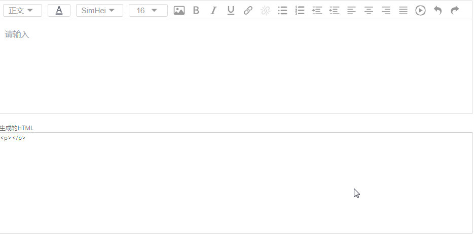

Fego-editor
---
基于DraftJS开发的富文本编辑器




安装
---
```
# 使用npm安装
npm install https://github.com/fegos/fego-editer --save
```

使用示例
---
```js
import React, { Component } from 'react';
import { EditorState } from 'draft-js';
import FegoEditor, { draftToHtml, htmlToDraft } from 'fego-editor';

export default class EditorTest extends Component {
  constructor(props) {
      super(props);
      const str = `<h1><span style="font-family:FangSong;">Hello World</span></h1>
          <video src="http://clips.vorwaerts-gmbh.de/big_buck_bunny.mp4" width="200px" height="auto"></video>`;
      const contentState = htmlToDraft(str);
      this.state = {
          editorState: EditorState.createWithContent(contentState),
          content: '',
      }
      this.toolBars = {
          Image: {
              uploadUrl: "",
              uploadCallback: () => {}
          }
      }
  }
  onChange = (editorState) => {
      this.setState({
          editorState,
          content: draftToHtml(editorContent),
      })
  }
  render() {
      let { editorState, content } = this.state;
      return (
          <div style={{ width: '70%', margin: '0 auto', padding: '15px' }}>
              <Editor editorState={editorState} onChange={this.onChange} toolBars= {this.toolBars} />
              <br/>
              <p>生成的HTML</p>
              <div style={{ width: '100%', height: '200px', border: '1px solid #ccc' }} >
                  {content}
              </div>
          </div>
      )
  }
}
```

属性
---
`editorState`: EditorState

以受控属性的方式更新编辑器的EditorState

`onChange`: EditorState

接收EditorState变化的回调函数

`toolBars`: Object

工具栏配置参数

`defaultEditorState`: EditorState

默认的EditorState

配置工具栏
---
通过传入toolBars的prop，用来配置工具栏

toolBars是一个对象类型，默认值为
```js
{
  options: ['BlockType', 'Color', 'FontFamily', 'FontSize', 'Image', 'Inline', 'Link', 'List',
      'TextAlign', 'Video', 'History'],
  BlockType: ['正文', 'H1', 'H2', 'H3', 'H4', 'H5', 'H6'],
  Color: ['rgb(97,189,109)', 'rgb(26,188,156)', 'rgb(84,172,210)', 'rgb(44,130,201)',
      'rgb(147,101,184)', 'rgb(71,85,119)', 'rgb(204,204,204)', 'rgb(65,168,95)', 'rgb(0,168,133)',
      'rgb(61,142,185)', 'rgb(41,105,176)', 'rgb(85,57,130)', 'rgb(40,50,78)', 'rgb(0,0,0)',
      'rgb(247,218,100)', 'rgb(251,160,38)', 'rgb(235,107,86)', 'rgb(226,80,65)', 'rgb(163,143,132)',
      'rgb(239,239,239)', 'rgb(255,255,255)', 'rgb(250,197,28)', 'rgb(243,121,52)', 'rgb(184,49,47)',
      'rgb(209,72,65)', 'rgb(124,112,107)', 'rgb(209,213,216)'],
  FontFamily: [{
      name: 'SimHei', family: '"SimHei", "黑体"'
  }, {
      name: 'Yahei', family: '"Microsoft Yahei", "微软雅黑"'
  }, {
      name: 'KaiTi', family: '"KaiTi", "楷体"'
  }, {
      name: 'FangSong', family: '"FangSong", "仿宋"'
  }],
  FontSize: [16, 20, 30, 40, 50, 70, 100, 200],
  History: ['undo', 'redo'],
  Image: {},
  Inline: ['bold', 'italic', 'underline'],
  List: ['ul', 'ol', 'indent', 'outdent'],
  TextAlign: ['left', 'center', 'right', 'justify'],
}
```
配置options来控制工具栏功能按钮显示，传入数组覆盖默认值

示例
```js
<Editor toolBars={{ options: [ 'BlockType', 'Color', 'FontSize' ] }} />
```
只会显示BlockType、Color、FontSize三种按钮

目前支持自定义Color、FontFamily、FontSize，传入数组覆盖默认值

示例
```js
<Editor toolBars={{ Color: [ 'cyan', 'red', 'orange' ], FontSize: [ 10, 20, 30, 40], FontFamily: [{
  name: 'Araial',
  family: 'Arial, Helvetica, sans-serif'
}] }} />
```

配置上传图片
---
配置toolBars的Image属性，uploadUrl为图片上传到服务器的url，uploadCallback为添加图片后的回调函数，返回值必须是图片的地址，默认使用ajax异步上传图片
```js
{
  uploadUrl: '',
  uploadCallback: (uploadUrl, file) => {}
}
```

鸣谢
---
- 感谢Jyoti Puri开发的[draftjs-utils](https://github.com/jpuri/draftjs-utils)提供的帮助和[react-draft-wysiwyg](https://github.com/jpuri/react-draft-wysiwyg)提供的参考，Thanks！
- 感谢超能刚哥开发的[braft-editor](https://github.com/margox/braft-editor)提供的参考，Thanks！
- 感谢HubSpot开发的[draft-convert](https://github.com/HubSpot/draft-convert)提供的帮助，Thanks！
